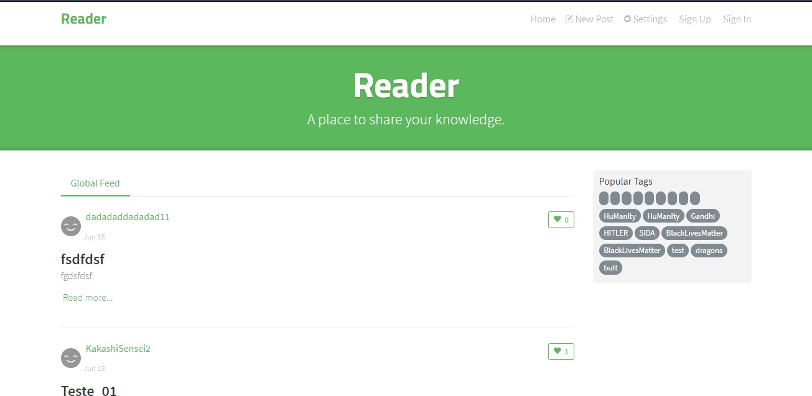

# Desafio 

    

Desafio proposto pela empresa para avaliar meu currículo e testar minhas habilidades utilizando a biblioteca React.

Como ainda eu só possuo experiencia com a biblioteca atraves dos meus estudos, desenvolver sozinho somente tento como base um projeto final foi um desafio a se interessante.

Esse projeto consiste em compartilhar artigos. Esses artigos podem ser curtidos e comentados, mas somente pode ser excluido pelo autor que publicou.
O sistema conta também com uma tela de login para os usuarios que já possuem cadastro e para aqueles que não possuem, o sistema da a opção de usuário se cadastar.

No seu feed, o usuário poderá acessar a lista outros artigos publicados e para que possa curti-los, é necessário o token de autenticação